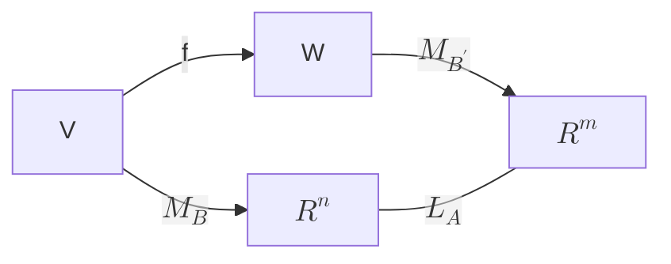

- [Introduzione](#introduzione)
  - [Prodotto scalare Euclideo](#prodotto-scalare-euclideo)
  - [Parallelismo](#parallelismo)
  - [Ortogonalità](#ortogonalità)
  - [Equazioni lineari](#equazioni-lineari)
  - [Sistemi lineari](#sistemi-lineari)
  - [Struttura algebrica di $\\mathbb{R}^n$](#struttura-algebrica-di-mathbbrn)
    - [Terminologia](#terminologia)
    - [Proprietà](#proprietà)
  - [matrici](#matrici)
  - [Operazioni con le matrici](#operazioni-con-le-matrici)
    - [Somma](#somma)
    - [Prodotto matrice per scalare](#prodotto-matrice-per-scalare)
    - [Matrice incompleta, completa](#matrice-incompleta-completa)
  - [Sistemi e matrici a scala](#sistemi-e-matrici-a-scala)
  - [Proposizione](#proposizione)
- [Eliminazione di Gauss](#eliminazione-di-gauss)
  - [Proposizione](#proposizione-1)
  - [Metodo di eliminazione di Gauss](#metodo-di-eliminazione-di-gauss)
  - [Esempio](#esempio)
- [Prodotto matrice per vettore](#prodotto-matrice-per-vettore)
  - [Proprietà](#proprietà)
  - [Proposizione](#proposizione-2)
- [Spazi e sottospazi](#spazi-e-sottospazi)
  - [Spazio vettiriale](#spazio-vettiriale)
  - [Sottospazio vettiriale](#sottospazio-vettiriale)
- [Spazio dei polinomi](#spazio-dei-polinomi)
- [Combinazioni lineari](#combinazioni-lineari)
- [Spazio generato](#spazio-generato)
- [Dipendenza lineare](#dipendenza-lineare)
- [Basi](#basi)
  - [Proposizione](#proposizione-3)
- [Coordinate](#coordinate)
  - [Teorema](#teorema)
- [Cardinalità della base](#cardinalità-della-base)
  - [Teorema](#teorema-1)
  - [Corollario](#corollario)
  - [Corollario](#corollario-1)
  - [Proposizione](#proposizione-4)
- [Esistenza della base](#esistenza-della-base)
- [Spazio somma e spazio intersezione](#spazio-somma-e-spazio-intersezione)
  - [Proposizione](#proposizione-5)
- [Formula di Grassmann](#formula-di-grassmann)
- [Trasposta](#trasposta)
- [Applicazioni lineari](#applicazioni-lineari)
- [Applicazioni lineari definite in termini di una base](#applicazioni-lineari-definite-in-termini-di-una-base)
- [Nucleo](#nucleo)
  - [Proposizione](#proposizione-6)
- [Immagine](#immagine)
  - [Teorema](#teorema-2)
  - [Corollario](#corollario-2)
- [Isomorfismi](#isomorfismi)
- [Matrice associata](#matrice-associata)
  - [Casi notevoli](#casi-notevoli)
- [Rango](#rango)
  - [Teorema di Rouchè-Capelli](#teorema-di-rouchè-capelli)
- [Prodotto di matrici](#prodotto-di-matrici)
  - [Proprietà del prodotto di matrici](#proprietà-del-prodotto-di-matrici)
  - [Proposizione](#proposizione-7)
- [Matrice identica e inversa](#matrice-identica-e-inversa)
  - [Caratterizzazione delle matrici invertibili](#caratterizzazione-delle-matrici-invertibili)
  - [Inversa matrici 2x2](#inversa-matrici-2x2)
- [Composizioni e matrici associate](#composizioni-e-matrici-associate)
- [Diagonalizzabilità](#diagonalizzabilità)
  - [Endomorfismi](#endomorfismi)
  - [Matrici diagonalizzabili](#matrici-diagonalizzabili)
- [Numeri complessi](#numeri-complessi)
  - [Somma](#somma-1)
  - [Prodotto](#prodotto)
  - [Coniugio](#coniugio)
  - [Modulo](#modulo)
  - [Proprietà di C](#proprietà-di-c)
- [Teorema fondamentale dell'algebra](#teorema-fondamentale-dellalgebra)
- [Diagonalizzazione su R e C](#diagonalizzazione-su-r-e-c)
- [Autovalori ed autovettori](#autovalori-ed-autovettori)
- [Autospazi](#autospazi)
- [Determinante](#determinante)
  - [Determinante di matrici con n piccoloù](#determinante-di-matrici-con-n-piccoloù)
  - [Proprietà del determinante](#proprietà-del-determinante)
- [Sviluppo di Laplace](#sviluppo-di-laplace)
- [Teorema di Binet](#teorema-di-binet)
- [Polinomio caratteristico](#polinomio-caratteristico)
- [Molteplicità algebrica e geometrica](#molteplicità-algebrica-e-geometrica)
- [Criteri di diagonalizzazione](#criteri-di-diagonalizzazione)
- [Prodotto scalare euclideo](#prodotto-scalare-euclideo-1)
  - [Proprietà del prodotto scalare euclideo](#proprietà-del-prodotto-scalare-euclideo)
- [Distanza](#distanza)
- [Disuguaglianza triangolare](#disuguaglianza-triangolare)
  - [Teorema di Cauchy-Schwarz](#teorema-di-cauchy-schwarz)
  - [Disuguaglianza triangolare](#disuguaglianza-triangolare-1)
- [Angoli](#angoli)
- [Complemento ortogonale](#complemento-ortogonale)
- [Proiezione ortogonale](#proiezione-ortogonale)
- [Basi ortonormali e algoritmo di Gram-Schmidt](#basi-ortonormali-e-algoritmo-di-gram-schmidt)
  - [Teorema di Gram-Schmidt](#teorema-di-gram-schmidt)
  - [Algoritmo di Gram-Schmidt](#algoritmo-di-gram-schmidt)
- [Teorema spettrale](#teorema-spettrale)

# Introduzione

**Sottospazio affine** = Lo spazio delle soluzioni di un sistema di equazioni lineari.

Piano = **luogo di zeri** dell'applicazione lineare.

Un’applicazione lineare può essere rappresentata da una matrice.

Operazioni naturali sullo spazio delle applicazioni lineari si riflettono in operazioni sulle matrici.

Alcune proprietà delle applicazioni lineari si riflettono in proprietà delle matrici.

## Prodotto scalare Euclideo

$$((x_1, y_1), (x_2, y_2))\rightarrow x_1x_2+y_1y_2$$

## Parallelismo

Date due rette $y=mx+q$ e $y=m'x+p'$:

$$m=m'\Rightarrow \text{Le due rette sono parallele.}$$

## Ortogonalità

Date due rette passanti per O e i rispettivi punti $(a, b)$ e $(a', b')$

$$aa'+bb'=0\Rightarrow\text{Le due rette sono ortogonali.}$$

## Equazioni lineari

Un’equazione lineare nelle incognite $x_1 ,\dots, x_k$ a coefficienti reali è
un’equazione della forma:

$$a_1x_1 +\cdots+ a_kx_k=b$$

L’insieme delle soluzioni dell'equazione è:

$$\lbrace(x_1 ,\dots, x_n)\in\mathbb{R}^n|a_1x_1+\cdots+a_nx_n=b\rbrace$$

$$b=0\Leftrightarrow \text{Equazione omogenea}$$

$$\text{Equazioni equivalenti} \Leftrightarrow \text{Stesse soluzioni}$$

## Sistemi lineari

Un sistema di equazioni lineari $x_1 ,\dots, x_n$ a coefficienti reali è un
insieme di equazioni lineari nelle incognite $x_1 ,\dots, x_n$ a coefficienti in
$\mathbb{R}$:

$$
\begin{cases}
    a_{11}x_1+\cdots+a_{1n}x_n=b_1\\
    \vdots\\
    a_{m1}x_1+\cdots+a_{mn}x_n=b_m\\
\end{cases}
$$

Dato un sistema lineare, l'insieme delle soluzioni è:

$$
\left\lbrace
(x_1 ,\dots, x_n)\in\mathbb{R}^n\ \big|
\begin{cases}
    a_{11}x_1+\cdots+a_{1n}x_n=b_1\\
    \vdots\\
    a_{m1}x_1+\cdots+a_{mn}x_n=b_m\\
\end{cases}
\right\rbrace
$$

Un sistema è omogeneo se ogni sua componente è omogenea:

$$\text{Sistema omogeneo}\Leftrightarrow \forall i\in[1:m]\mid b_i = 0$$

$$\text{Sistemi equivalenti} \Leftrightarrow \text{Stesse soluzioni}$$

## Struttura algebrica di $\mathbb{R}^n$

Su $\mathbb{R}^n$ esistono due operazioni naturali:

- ### Somma

$$\mathbb{R}^n\times\mathbb{R}^n\rightarrow\mathbb{R}^n$$
$$(x_1,\dots,x_n)+(y_1,\dots,y_n)=(x_1y_1,\dots,x_ny_n)$$

- ### Prodotto per scalare

$$\mathbb{R}\times\mathbb{R}^n\rightarrow\mathbb{R}^n$$

$$\lambda(x_1,\dots,x_n)=(\lambda x_1,\dots,\lambda x_n)$$

Dato un sistema lineare:

$$
\begin{cases}
    a_{11}x_1+\cdots+a_{1n}x_n=b_1\\
    \vdots\\
    a_{m1}x_1+\cdots+a_{mn}x_n=b_m\\
\end{cases}
$$

 

$$
(x_1 , \dots, x_n)\in\mathbb{R}^n=soluzione
$$

$$
\Leftrightarrow
$$

$$
x_1\begin{pmatrix}
        a_{11}\\
        \vdots\\
        a_{m1}
    \end{pmatrix} + \cdots + x_n
    \begin{pmatrix}
        a_{1n}\\
        \vdots\\
        a_{mn}
    \end{pmatrix} =
    \begin{pmatrix}
        b_1\\
        \vdots\\
        b_m
    \end{pmatrix}
$$

### Terminologia

Elemento $\mathbb{R}^n$ = vettore

Elemento $\mathbb{R}$ = scalare

### Proprietà

1. $(v + w) + u = v + (w + u)$
2. $v + \mathbf{0} = v = \mathbf{0} + v$
3. $v + (-1)v = \mathbf{0} = (-1)v + v$
4. $v + w = w + v$
5. $\lambda(\mu v) = (\lambda \mu)v$
6. $\lambda(v + w) = (\lambda v) + (\lambda w)$
7. $(\lambda + \mu)v = \lambda v + \mu v$
8. $1v = v$

$$\forall\space\lambda\mu\in\mathbb{R}\land u, v, w\in\mathbb{R}^n$$

## matrici

Una matrice $m\times n$ a coefficienti in $\mathbb{R}$ = tabella con $m$ righe ed $n$ colonne di elementi di $\mathbb{R}$:

$$
A=\begin{pmatrix}
    a_{11}&\cdots&a_{1n}\\
    \vdots&&\vdots\\
    a_{m1}&\cdots&a_{mn}
\end{pmatrix}
$$

Un vettore riga è una matrice $1\times n$; un vettore colonna è una
matrice $m\times1$.

La riga i-esima della matrice $(a_{ij})$ è il vettore:

$$A_i=(a_{i1},\dots,a_{in});$$

La colonna j-esima della matrice $(a_{ij})$ è il vettore:

$$
A^j=\begin{pmatrix}
    a_{1j}\\
    \vdots\\
    a_{mj}
\end{pmatrix}
$$

Fissati $m$ ed $n$, l’insieme delle matrici $m\times n$ a coefficienti in $\mathbb{R}$ si indica
con $M_{m,n} (\mathbb{R})$.

Vettori riga e colonna si identificano con le n-uple. Le matrici $1\times 1$ si
identificano con gli scalari.

## Operazioni con le matrici

### Somma

Date due matrici $m\times n$:

$$A=(a_{ij}), B=(b_{ij})$$

La matrice $m\times n$:

$$C=(c_{ij})\ |\ c_{ij} = a_{ij}+b_{ij}$$

è detta somma di $A$ e $B$ e si scrive $C=A+B$.

### Prodotto matrice per scalare

Date una matrice $m\times n$:

$$A=(a_{ij})$$

ed uno scalare $\lambda\in\mathbb{R}$, la matrice $m\times n$:

$$B=(b_{ij}), b_{ij}=\lambda a_{ij}$$

è detta prodotto di $A$ per $\lambda$ e si scrive $B=\lambda A$

### Matrice incompleta, completa

Dato un sistema lineare:

$$
\begin{cases}
    a_{11}x_1+\cdots+a_{1n}x_n=b_1\\
    \vdots\\
    a_{m1}x_1+\cdots+a_{mn}x_n=b_m\\
\end{cases}\\
$$

Matrice dei coefficienti o incompleta:

$$
A=(a_{ij}) =\begin{pmatrix}
    a_{11}&\cdots&a_{1n}\\
    \vdots&&\vdots\\
    a_{m1}&\cdots&a_{mn}
\end{pmatrix}
$$

Matrice completa

$$
(A|B) = \left(\begin{array}{ccc|c}
a_{11} & \cdots & a_{1n} & b_1 \\
\vdots & \ddots & \vdots & \vdots \\
a_{m1} & \cdots & a_{mn} & b_m
\end{array}\right)
$$

## Sistemi e matrici a scala

Data una matrice $A$, se $A_i$ è una riga di elementi non tutti nulli, diciamo
che il pivot sulla riga $A_i$ è il primo elemento non nullo.

La matrice si dice a scala se valgono le seguenti condizioni:

- ogni pivot è strettamente a destra dei pivot delle righe precedenti;
- Le righe senza pivot stanno sotto le righe con un pivot.

Un sistema lineare è a scala se la matrice incompleta è a scala.

$$
\begin{pmatrix}
a_{11} & \cdots & \cdots & \cdots & a_{1n} \\
0 & a_{22} & \cdots & \cdots & a_{2n} \\
0 & 0 & \ddots & & \vdots \\
0 & 0 & 0 & a_{rr} & \cdots & a_{rn} \\
0 & 0 & 0 & 0 & \cdots & 0 \\
\vdots & \vdots & \vdots & \vdots & \ddots & \vdots \\
0 & 0 & 0 & 0 & \cdots & 0
\end{pmatrix}
$$

## Proposizione

Dato un sistema lineare a coefficienti in $\mathbb{R}$ di $m$ equazioni in $n$ incognite
la cui matrice incompleta è a scala con $r$ pivot:

- $\exists i\in[r+1,m]\ |\ b_i\neq 0\Rightarrow$ non esiste soluzione;
- $\forall i\in[r+1,m]\ |\ b_i=0\Rightarrow$ esiste una soluzione:
  - $r=n\Rightarrow$ la soluzione è unica;
  - $r<n\Rightarrow$ le soluzioni sono in corrispondenza biunivoca con $\mathbb{R}^{n-r}$.

# Eliminazione di Gauss

## Proposizione

Applicando a un sistema lineare una delle seguenti operazioni:

1. moltiplicare un'equazione per uno scalare diverso da 0;
2. scambiare due equazioni;
3. aggiungere a un'equazione un multiplo di un'altra,

si ottiene un sistema lineare equivalente.

## Metodo di eliminazione di Gauss

Consiste nel trasformare un sistema lineare con matrice completa $(A|B)$
in un sistema a scala applicando operazioni elementari.

1. Se $A$ è la matrice nulla, è già a scala.
2. Altrimenti, identificare la prima colonna non nulla $A^k$ di $A$.
3. Tra gli elementi di $A^k$ uno è non nullo. Sceglierne uno, diciamo $a_{hk}$ ;
   se $h\neq1$, scambiare la riga h-esima della matrice completa con la
   prima.
4. $\forall\ i > 1$, sommare alla riga i-esima un multiplo della prima
   riga in modo che il termine $a_{ik}$ diventi zero.
5. Ripetere il processo per la sottomatrice.

## Esempio

$$
\begin{cases}
2x_1 + x_2 + 3x_3 &= 2 \\
x_1 - x_2 &= 3 \\
2x_1 + 2x_3 &= 1 \\
-x_1 + x_2 &= 3
\end{cases}
$$

$$
\left(\begin{array}{ccc|c}
2 & 1 & 3 & 2\\
1 & -1 & 0 & 3\\
2 & 0 & 2 & 1\\
-1 & 1 & 0 & 3
\end{array}
\right)\begin{array}{c}
I + 2\cdot IV\\
II + IV\\
III + 2\cdot IV\\
I\leftrightarrow IV\\
\end{array}\rightarrow
\left(\begin{array}{ccc|c}
-1 & 1 & 0 & 3\\
0 & 0 & 0 & 6\\
0 & 2 & 2 & 7 \\
0 & 3 & 3 & 8
\end{array}
\right)\\
$$

$$
b_2\neq0\Rightarrow\text{Il sistema non ha soluzione}
$$

# Prodotto matrice per vettore

Data una matrice $m\times n$:

$$A = (a_{ij})$$

ed un vettore colonna:

$$
B=\begin{pmatrix}
    b_1\\
    \vdots\\
    b_n
\end{pmatrix}
$$

il prodotto $AB$ è definito come il vettore:

$$AB=b_1A_1+\cdots+b_nA_n$$

(colonna per riga)

Introdotto il vettore delle incognite:

$$
X=\begin{pmatrix}
    x_1\\
    \vdots\\
    x_n
\end{pmatrix}
$$

un sistema lineare con matrice completa (A|B) può essere scritto nella forma:

$$AX=B$$

## Proprietà

Siano $A$, $B$ matrici $m\times n$ e siano $X$, $Y$ vettori con $n$ componenti; sia $\lambda$
uno scalare, vale che:

1. $A(X+Y)=AX+AY$;
2. $(A+B)X=AX+AB$;
3. $A(\lambda X)=\lambda(AX)$.

## Proposizione

Data $A\in M_{m,n} (\mathbb{R})$, sia $W$ l'insieme delle soluzioni del sistema lineare
omogeneo $AX = 0$. Dato $B\in R_n$, se il sistema lineare $AX = B$ ammette
una soluzione $X_0$, le sue soluzioni sono tutte e soli i vettori:

$$X_0 + Y\in\mathbb{R}^n,$$

al variare di $Y\in W$.

# Spazi e sottospazi

## Spazio vettiriale

Uno spazio vettoriale reale è un insieme V su cui sono definite due
operazioni:

$$V\times V\rightarrow V,\quad(v,w)\rightarrow v+w$$

$$\mathbb{R}\times V\rightarrow V,\quad(a,v)\rightarrow av$$

che soddisfano le seguenti proprietà:

- $(v+w)+u=v+(w+u)$;
- $\exists 0\in V | V+0=V=0+V$;
- $v+(-1)v=0=(-1)v+v$;
- $v+w=w+v$;
- $\lambda(\mu v)=(\lambda\mu)v$;
- $\lambda(v+w)=(\lambda v)+(\lambda w)$;
- $(\lambda+\mu)v=\lambda v+\mu v$;
- $1v=v$;
- Elemento $V$ = vettore;
- Elemento $\mathbb{R}$ = scalare.

## Sottospazio vettiriale

Dato uno spazio vettoriale V, un sottospazio di V è $W\subset V\ |$ :

- $0\in W$
- $v,w\in W\Rightarrow v+w\in W$
- $v\in W\land c\in\mathbb{R}\Rightarrow cv\in W$

Il sottospazio $W\subset V$ è ancora uno spazio vettoriale.

# Spazio dei polinomi

Sia $a:N\rightarrow R$ una funzione:
$$(i\rightarrow a_i | \exists n\in\mathbb{N}\ |\ \forall i\in[0, n]\ .\ a_i\neq 0)$$

Polinomio a coefficienti reali nell'indeterminata $x$:

$$p=a_0x^0+\cdots a_nx^n$$

Per costruzione, 0 è un polinomio ($\forall i\in[0, n]\ .\ a_i=0$);

Il grado di $p\neq0$ viene indicato con $deg\ p$ ed è uguale a $n$, $deg\ 0 =-\infty$;

L'insieme dei polinomi a coefficienti reali nell'indeterminata $x$ si
indica con $\mathbb{R}[x]$.

Lo spazio dei polinomi ha una struttura di spazio vettoriale.

# Combinazioni lineari

Dati due vettori:

- $v_1,\dots,v_k$ di uno spazio vettoriale V
- $a_1,\dots,a_k$ di scalari

Il vettore:

$$a_1v_1,\dots,a_kv_k$$

è una combinazione lineare di $v_1,\dots,v_k$.

Una combinazione lineari si definisce **banale** se:

$$\forall i\in[1,k]\ .\ a_i=0$$

 

$$k=0\Rightarrow 0\in V\text{combinazione lineare di 0 vettori}$$

# Spazio generato

Dato uno spazio vettoriale $V$ e vettori $v_1,\dots,v_k\in V$ si dice spazio generato da $v_1,\dots,v_k$ l'insieme dei vettori che sono combinazioni lineari di $v_1,\dots,v_k$:

$$Span\lbrace v_1,\dots,v_k\rbrace=\lbrace a_1v_1+\cdots+a_kv_k|a_1,\dots,a_k\in\mathbb{R}\rbrace$$

Lo spazio generato è un sottospazio.

Se $W$ è un sottospazio di V che contiene $v_1,\dots,v_k$, allora W contiene Span{$v_1,\dots,v_k$}.

Quindi Span{$v_1,\dots,v_k$} è il più piccolo sottospazio di $V$ che contiene $v_1,\dots,v_k$.

# Dipendenza lineare

$$
\exists i\in[1,k]|a_i\neq 0\land a_1v_1+\cdots+a_kv_k=0\Rightarrow\\
v_1,\dots,v_k\text{ sono linearmente dipendenti}
$$

$$
(\exists\text{ una combinazione lineare di }v_1,\dots,v_k\text{ non banale pari a 0 }\Rightarrow\\
v_1,\dots,v_k\text{ sono linearmente dipendenti.})
$$

Vattore linearmente dipandente $\Leftrightarrow$ è 0.

Due vettori sono linearmente dipendenti $\Leftrightarrow$ uno dei due è multiplo dell'altro.

# Basi

Se $v1,\dots,vk$ sono vettori linearmente indipendenti che generano $V$, si dice che i vettori $v1,\dots,vk$ formano una base di V o che l’insieme $\lbrace v1,\dots,vk\rbrace$ è una base di V.

## Proposizione

Data una matrice $A,n\times n$, sono equivalenti:

- le colonne $A^1,\dots,A^n$ sono una base;
- $\exists$ una riduzione a scala di $A$ con $n$ pivot;
- ogni riduzione a scala di $A$ ha $n$ pivot.

# Coordinate

## Teorema

Sia $V$ uno spazio vettoriale e siano $v_1,\dots,v_k$ vettori linearmente indipendenti.

$$a_1v_1,\dots,a_kv_k=b_1v_1,\dots,b_kv_k\Rightarrow\forall i\in[1,k]\ .\ a_i=b_i$$

Se i vettori $v_1,\dots,v_k$ formano una base di $V$ ogni vettore $v\in V$ si scrive in modo unico come:

$$x_1v_1,\dots,x_kv_k$$

Si dice che $v_1,\dots,v_k$ sono le coordinate di v rispetto alla base.

# Cardinalità della base

## Teorema

Sia $v_1,\dots,v_m$ una base di V, e siano $w_1,\dots,w_n$ vettori di $V$, con $n>m$. Allora $w_1,\dots,w_n$ sono linearmente dipendenti.

## Corollario

Supponiamo che i vettori $v_1,\dots,v_k$ formino una base di $V$; allora ogni altra base contiene $k$ elementi.

Se $V$ ha una base finita, si dice che la cardinalità della base è la dimensione di $V$.

Se $V$ è lo spazio vettoriale banale la dimensione è zero.

Se non esiste una base finita si dice che la dimensione è infinita:

$$dim\ V=+\infty.$$

## Corollario

Sia A una matrice $m\times n$, con $n>m$. Il sistema lineare $AX = 0$ ha almeno una soluzione non banale.

## Proposizione

Siano:

$$A\in M_{m,n}(\mathbb{R})$$

$$W=\lbrace X\in\mathbb{R}^n|AX=0\rbrace$$

Se una riduzione a scala di $A$ ha $r$ pivot, allora $dim\ W = n − r$.

# Esistenza della base

Uno spazio vettoriale generato da $n$ vettori ha una base con $k\leq n$ elementi.

Dato uno spazio vettoriale $V$ di dimensione $n$, se $v_1,\dots,v_n$ sono linearmente indipendenti allora costituiscono una base.

Se $V$ ha dimensione $n$ e $W\subseteq V$ è un sottospazio, allora $dim\ W\leq n$, e vale l’uguaglianza solo se $W = V$.

Sia $V$ uno spazio vettoriale di dimensione $n$ e siano $v_1,\dots,v_k$ elementi linearmente indipendenti di $V$. Allora esistono vettori $v_{k+1},\dots,v_n$ tali
che i vettori $v_1,\dots,v_n$ formano una base di $V$.
Si dice che $v_1,\dots,v_n$ è un completamento della base.

# Spazio somma e spazio intersezione

Sia $V$ uno spazio vettoriale; siano $U,W\subseteq V$ sottospazi:

- $U\cap W$ è un sottospazio;
- In generale $U\cup W$ non è un sottospazio;
- Si definisce $U+W=\lbrace u+w|u\in U,w\in W\rbrace$;
- $U+W$ è un sottospazio;
- Si dice che $U$ e $W$ sono in somma diretta se $U\cap W = \lbrace 0\rbrace$;
- $V=U+W\land U\cap W=\lbrace0\rbrace\Rightarrow V=U\oplus W\land W\text{ è complemento di }U$.

## Proposizione

$$
V=U\oplus W\Leftrightarrow\text{ ogni vettore di }V\text{ si
scrive in modo unico come }u+w, u\in U\land w\in W.
$$

# Formula di Grassmann

Sia $V$ uno spazio vettoriale di dimensione finita,
e siano $U,W\subseteq V$ sottospazi. Allora:

$$dim(U+W)+dim(U\cap W) = dim(U)+dim(W)$$

# Trasposta

Data una matrice $A\in M_{n,n}(\mathbb{R})$,
la trasposta di $A=(a_{ij})$ è la matrice
$B=(b_{ij})\text{ con } b_{ij}=a_{ji}$

Si scrive:

$$B=A^t$$

Valgono:

$$(A^t)^t=A$$

$$A^t=A\Rightarrow A\text{ è simmetrica.}$$

$$A^t=-A\Rightarrow A\text{ è antisimmetrica.}$$

Gli spazi:

$$U=\lbrace A\in M_{n,n}(\mathbb{R})|A^t=A\rbrace$$

$$V=\lbrace A\in M_{n,n}(\mathbb{R})|A^t=-A\rbrace$$

Sono sottospazi di $M_{n,n}(\mathbb{R})$.

Vale:

$$U\oplus W=M_{n,n}(\mathbb{R})$$

# Applicazioni lineari

Siano $V$ e $W$ due spazi vettoriali. Si dice che un'applicazione

$$f:V\rightarrow W$$

è lineare $\Leftarrow\forall u,v\in V,c\in\mathbb{R}$ soddisfa:

- $f(u+v)=f(u)+f(v)$
- $f(cu)=cf(u)$

Ogni applicazione lineare soddisfa:

$$f(0)=0$$

$$f(a_1v_1+\cdots+a_nv_n)=a_1f(v_1)+\cdots+a_nf(v_n)$$

# Applicazioni lineari definite in termini di una base

Siano $V, W$ spazi vettoriali e siano $v_1,\dots,v_n$ i vettori di una base di V.
Dati vettori $w_1,\dots,w_n\in W$ eiste un'unica applicazione lineare
$f:V\rightarrow W|f(v_i)=w_i$;

Esplicitamente:

$$f(a_1v_1+\cdots+a_nv_n)=a_1w_1+\cdots+a_nw_n$$

# Nucleo

Data un'applicazione lineare $f:V\rightarrow W$,
il nucleo di f è lo spazio:

$$Ker\ f=\lbrace v\in V|f(v)=0\rbrace$$

Esso è un sottospazio vettoriale.

Data una matrice $A\in M_{m,n}(\mathbb{R})$, il nucleo di A
è il nucleo $Ker\ A=Ker\ L_A$ dell'applicazione lineare associata
$L_A:\mathbb{R}^n\rightarrow\mathbb{R}^m$

$$Ker\ f=0\Leftrightarrow f\ iniettiva.$$

## Proposizione

$$
f:V\rightarrow W\ lineare\land iniettiva\Rightarrow\\
v_1,\dots,v_n\in V\text{ linearmente indipendenti}\Rightarrow\\
f(v_1),\dots,f(v_n)\text{ sono linearmente indipendenti.}
$$

# Immagine

Data un'applicazione lineare $f:V\rightarrow W$, la sua immagine è lo spazio:

$$Im\ f =\lbrace f(v)|v\in V\rbrace.$$

Esso è un sottospazio vettoriale.

$$f\ suriettiva\Leftrightarrow Im\ f =W.$$

$$A\ matrice\Rightarrow Im\ A=Im\ L_A$$

$$A=(A^1,\dots,A^n)\Rightarrow Im\ A=Span\lbrace A^1,\dots,A^n\rbrace$$

## Teorema

$$
f:V\rightarrow W\text{ lineare }\land V\text{ di dimensione finita}\Rightarrow\\
dim\ V = dim\ Im\ f+dim\ Ker\ f
$$

## Corollario

$$
f:V\rightarrow W|dim\ V=dim\ W<+\infty\Rightarrow\\
f\ iniettiva\Leftrightarrow f\ suriettiva.
$$

# Isomorfismi

Date applicazioni lineari:

$$f:V\rightarrow W,g:W\rightarrow U$$

la composizione:

$$g\circ f:V\rightarrow U$$

è un'applicazione lineare.

- Un'applicazione lineare $f:V\rightarrow W$ è un isomorfismo se è biunivoca.
- Due spazi vettoriali sono isomorfi se esiste un isomorfismo tra di essi.

$$f:V\rightarrow W\text{ è un isomorfismo}\Rightarrow f^{-1}:W\rightarrow V\text{ è un isomorfismo}$$

- $B=\lbrace v_1,\dots,v_n\rbrace\text{ base di }V\Rightarrow M_B:V\rightarrow\mathbb{R}^n\text{ è un isomorfismo.}$
- Ogni spazio vettoriale di dimensione finita è isomorfo a $\mathbb{R}^n$.

Dato $B=\lbrace v_1,\dots,v_n\rbrace$ una base di $V$, abbiamo isomorfismo:

$$M_B:V\rightarrow\mathbb{R}^n,M_B(v_i)=e_i$$

# Matrice associata

Siano:

- $V,W$ spazi vettoriali su $\mathbb{R}$;
- $v_1,\dots,v_n$ vettori di $V$ che formano una base $B$;
- $w_1,\dots,w_n$ vettori di $W$ che formano una base $B'$;
- $f:V\rightarrow W$ un'applicazione lineare.

Otteniamo isomorfismi:

$$M_B:V\rightarrow\mathbb{R}^n,M_{B'}:W\rightarrow\mathbb{R}^m$$

$A$ è la matrice associata a $f$ rispetto alle basi $B, B'$; scriviamo:

$$M^B_{B'}(f)=A$$

Equivalentemente:

La matrice associata a $f$ è l’unica matrice $M^B_{B'}$ che soddisfa:

$$M^B_{B'}(f)M_B(v)=M_{B'}(f(v))$$

## Casi notevoli

$$
V=\mathbb{R}^n, W=\mathbb{R}^m\land B,B'=\text{basi canoniche}\Rightarrow\\
M^B_{B'}(f)\text{ soddisfa }Av=f(v), cioé\ f=L_A
$$

$$
W=\mathbb{R}^m\land C=\text{base canonica}\Rightarrow\\
M^B_C(f)=(f(v_1),\dots,f(v_n))
$$

In generale, la colonna j-esima di $M^B_{B'}(f)$ è il vettore (colonna) delle coordinate di $f(v_j)$ rispetto a $B'$.

$$
B,B'\text{ basi di }V\Rightarrow M_{B'}(v)=M^B_{B'}(Id)M_B(v)
$$

La matrice $M^B_{B'}(Id)$ è la matrice del cambiamento di base da $B$ a $B'$

Siano:

$$
\begin{pmatrix}
  x_1\\
  \vdots\\
  x_n
\end{pmatrix}=\text{coordinate di v rispetto a B}
$$

$$
\begin{pmatrix}
  y_1\\
  \vdots\\
  y_n
\end{pmatrix}=\text{coordinate di v rispetto a B'}
$$

allora:

$$
\begin{pmatrix}
  y_1\\
  \vdots\\
  y_n
\end{pmatrix}=M^B_{B'}(Id)\begin{pmatrix}
  x_1\\
  \vdots\\
  x_n
\end{pmatrix}
$$

$$
B\land B'\ coincidono\Leftrightarrow M^B_{B'}(Id)=I
$$

# Rango

Il rango (per colonne) di una matrice $A\in M_{m,n}(\mathbb{R})$ è $rank\ A = dim\ Im\ A$.

Il rango per righe di una matrice $A\in M_{m,n}(\mathbb{R})$ è la dimensione
di $Span\lbrace A_1,\dots,A_m\rbrace\subseteq M_{1,n}(\mathbb{R})=\mathbb{R}^n$

Il rango per righe di $A$ è il rango per colonne di $A^t$.

Data una matrice $A\in M_{m,n}(\mathbb{R})$:

$$rank\ A=rank\ A^t$$

(Il rango per righe è uguale al rango per colonne)

## Teorema di Rouchè-Capelli

Sia $A\in M_{m,n}(\mathbb{R}),B\in\mathbb{R}^n$:

$$Ax=b\Leftrightarrow rank(A) = rank(A|B)$$

# Prodotto di matrici

Data un'applicazione lineare $L_A:\mathbb{R}^n\rightarrow\mathbb{R}^m,\exists$
un'unica matrice $A\in M_{m,n}(\mathbb{R})|L_A(X)=AX$

Data una matrice $m\times n$:

$$A=(a_{ij})$$

e una matrice $n\times k$:

$$B=(b_{ij})$$

possiamo considerare la composizione:

$$\mathbb{R}^k\overset{L_B}{\rightarrow}\mathbb{R}^n\overset{L_A}{\rightarrow}\mathbb{R}^m,\quad X\rightarrow L_A(L_B(X))=A(B(X))$$

---

$$L_A\circ L_B=L_C\Rightarrow C^i=L_A(L_B(e_i))=AB^i$$

---

Data una matrice $m\times n$:

$$A=(a_{ij})$$

e una matrice $n\times k$:

$$B=(b_{ij})$$

definiamo il prodotto $AB$ come la matrice $m\times k$:

$$AB=(AB^1,\dots,AB^k).$$

La j-esima colonna di $AB$ è:

$$
A\begin{pmatrix}
  b_{1j}\\
  \vdots\\
  b_{nj}
\end{pmatrix}=b_{1j}A^1+\cdots+b_{nj}A^n=\begin{pmatrix}
  b_{1j}a_{11}+\cdots+b_{nj}a_{1n}\\
  \vdots\\
  b_{1j}a_{m1}+\cdots+b_{nj}a_{mn}
\end{pmatrix}
$$

## Proprietà del prodotto di matrici

$$AB=(c_{ij})\Rightarrow c_{ij}=\sum_{h=1}^na_{ih}b_{hj}=A_iB_j$$

- la i-esima riga di $AB$ è:

$$(AB)_i=A_iB;$$

- la j-esima colonna di AB è:

$$(AB)^j=AB^j$$

Date due matrici $A\land B$:

$$A=m\times n\land B = n\times k\Rightarrow\text{il prodotto è ben definito}$$

$$A=m\times n\land B = m\times n\Rightarrow\text{la somma è ben definita}$$

## Proposizione

Siano $A=(a_ij), B=(b_ij), C=(c_ij)$ tre matrici e $\lambda$ uno scalare:

$$AB,AC,B+C\text{ ben definiti}\Rightarrow A(B+C)=AB+AC$$

$$AC,BC,A+B\text{ ben definiti}\Rightarrow (A+B)C=AC+BC$$

$$AC\text{ ben definiti}\Rightarrow A(\lambda C)=\lambda (AC)$$

$$AB,BC\text{ ben definiti}\Rightarrow A(BC)=(AB)C$$

# Matrice identica e inversa

La matrice identità $I\in M_{n,n}(\mathbb{R})$ è la matrice:

$$
I = (e_1 \cdots e_n) = \begin{pmatrix}
1 & \cdots &  &  &  \\
\vdots & 1 &  &  &  \\
 &  & \ddots &  &  \\
 &  &  & 1 & \cdots \\
 &  &  &  & \ddots \\
 &  &  &  &  & 1
\end{pmatrix}
$$

assocoiata all'applicazione identica $\mathbb{R}^n\rightarrow\mathbb{R}^n,\quad v\rightarrow v$.

In particolare:

$$AI=A=IA$$

Data $A\in M_{n,n}(\mathbb{R})$:

- $\exists B\in M_{n,n}(\mathbb{R})|AB=I=BA\Rightarrow A\text{ invertibile}$
- B è inversa di A, $B=A^{-1}$

Allora:

$$A\text{ è invertibile}\Leftrightarrow L_A:\mathbb{R}^n\rightarrow\mathbb{R}^n\text{ è invertibile}$$

$$B\text{ è l'inversa di }A\Rightarrow L_B\text{ è l'inversa di }L_A$$

## Caratterizzazione delle matrici invertibili

Sia $A$ una matrice $n\times n$. Sono equivalenti:

- $A$ è invertibile;
- $L_A$ è invertibile;
- $L_A$ è iniettiva;
- $L_A$ è suriettiva;
- le righe di $A$ sono linearmente indipendenti;
- le colonne di $A$ sono linearmente indipendenti $(Rank\ A = n)$;
- ogni matrice ottenuta da $A$ applicando l'eliminazione di Gauss ha n pivot;
- il sistema $AX=0$ ha solo la soluzione banale;
- il sistema $AX=B$ ha un'unica soluzione $\forall\ B$.

L'inversa di A è la matrice B ottenuta trasformando con operazioni elementari:

$$(A|I)\rightarrow(I|B)$$

## Inversa matrici 2x2

Se:

$$
A=\begin{pmatrix}
  a & b\\
  c & d
\end{pmatrix}
$$

allora:

$$
A^{-1}=\frac{1}{ad-bc}\begin{pmatrix}
  d & -b\\
  -c & a
\end{pmatrix}
$$

# Composizioni e matrici associate

Siano $V,W,U$ tre spazi vettoriali, e siano $B,B',B''$ rispettivamente basi di $V,W,U$.

Siano:

$$f:V\rightarrow W,\quad g:W\rightarrow U$$

applicazioni lineari. Allora:

$$M^{B'}_{B''}(g)M^{B}_{B''}(f)=M^{B}_{B''}(g\circ f)$$

Siano $B\land B'$ due basi di $V\Rightarrow$ le matrice del cambiamento da una base all'altra sono una l'inversa dell'altra.

# Diagonalizzabilità

## Endomorfismi

Un'applicazione lineare $f:V\rightarrow V$ è detta endomorfismo.

Sia $f:V\rightarrow V$ un endomorfismo e siano $B,B'$ basi di V. Allora:

$$M_{B'}^{B'}(f)=N^{-1}M_B^B(f)N\ |\ N=M_B^{B'}(Id)$$

$$\text{ due matrici }A,B\in M_{n,n}(K)\text{ sono simili}\Leftarrow\exists\text{ una matrice invertibile }N\ |\ N^{-1}AN=B.$$

- è una relazione di equivalenza su $M_{n,n}(K)$;
- tutte le matrici associate a un endomorfismo fissato $f:V\rightarrow V$ sono simili tra loro;

## Matrici diagonalizzabili

- $A=(a_{ij})$ è diagonale $\Leftarrow\forall i\neq j\ .\ a_{ij}=0$;
- un endomorfismo $f:V\rightarrow V$ è diagonalizzabile se rispetto a qualche base la matrice associata è diagonale;
- una matrice quadrata $A$ è diagonalizzabile $\Leftrightarrow L_A$ è diagonalizzabile.

$$f\text{ è diagonalizzabile}\Leftrightarrow\exists\text{ una base }v_1,\dots,v_n\in V|f(v_i)=\lambda_iv_i$$

# Numeri complessi

Indichiamo con $\mathbb{C}$ l'insieme dei numeri complessi:

$$\mathbb{C}=\lbrace a+ib|a,b\in\mathbb{R}\rbrace$$

Definiamo le seguenti operazioni:

## Somma

$$\mathbb{C}\times\mathbb{C}\rightarrow\mathbb{C},\quad(a+ib)+(c+id)=a+c+i(b+d)$$

## Prodotto

$$\mathbb{C}\times\mathbb{C}\rightarrow\mathbb{C},\quad(a+ib)(c+id) = (ac−bd)+i(ad+bc)$$

## Coniugio

$$\mathbb{C}\rightarrow\mathbb{C},\quad\overline{a+ib}=a-ib$$

## Modulo

$$\mathbb{C}\rightarrow\mathbb{R},\quad|a+ib|=\sqrt{a^2+b^2}$$

Si ha un’inclusione naturale di $\mathbb{R}\subset \mathbb{C}$, cioè una mappa:

$$\mathbb{R}\rightarrow\mathbb{C},\quad a\rightarrow a+i0$$

che rispetta somma e prodotto.

## Proprietà di C

Dati $z,w,u\in\mathbb{C}$:

- $(z+w)+u=z+(w+u)$
- $z+0=z=0+z$
- $\exists -z|z+(-z)=0=(-z)+z$
- $z+w=w+z$
- $z(w+u)=zw+zu$
- $(z+w)u=zu+wu$
- $zw=wz$
- $1z=z$
- $z\neq 0\Rightarrow\exists w | zw=1=wz$ (w è l'inverso di z)

# Teorema fondamentale dell'algebra

Ogni polinomio di grado positivo in $\mathbb{C}[x]$ ha almeno una radice.

Quindi:

- Ogni polinomio $\mathbb{C}[x]$ ha la forma:

$$b(x-a_1)\cdots(x-a_n),\quad a_1,\dots,a_n\in\mathbb{C}$$

- Ogni polinomio $\mathbb{R}[x]$ ha la forma:

$$bp_1\cdots p_n$$

$$\text{dove }b\in\mathbb{R}\land p_1,\dots,p_n\text{ hanno grado}\leq 2.$$

# Diagonalizzazione su R e C

Se $A\in M_{n,n}(\mathbb{R})$, vale una delle tre:

- A è diagonalizzabile su $\mathbb{R}$ e su $\mathbb{C}$;
- A è diagonalizzabile su $\mathbb{C}$ ma non su $\mathbb{R}$;
- A non è diagonalizzabile.

# Autovalori ed autovettori

Sia $f:V\rightarrow V$ un'applicazione lineare. Diciamo che:

- un vettore $v\neq 0$ è un autovettore di $f\Leftarrow f(v)=\lambda v$ per qualche $\lambda\in\mathbb{R}$;
- $\lambda$ è un autovalore di $f$;
- $v$ è un autovettore relativo all'autovalore $\lambda$;

$A=n\times n\Rightarrow$ si definiscono autovalori ed autovettori in termini di $L_A:\mathbb{R}^n\rightarrow\mathbb{R}^n$.

- $A=$ matrice diagonale $\Rightarrow$ i vettori della base canonica sono autovettori.
- $A=\lambda Id\Rightarrow$ tutti i vettori $\neq 0$ sono autovettori $\land$ l'unico autovalore è $\lambda$.
- Un'applicazione lineare è diagonalizzabile $\Leftrightarrow\exists$ una base di autovettori.

# Autospazi

Data $f:V\rightarrow V$ lineare ed autovalore $\lambda$, si definisce:

$$V_\lambda=\lbrace v\in V|f(v)=\lambda v\rbrace.$$

- $V_\lambda$ lo spazio di tutti gli autovettori relativi a $\lambda$ uniti allo 0.
- $V_\lambda$ è lo spazio relativo a $\lambda$.

---

Sia $f:V\rightarrow V$ lineare, e sia $\lambda$ un autovalore. Allora:

$$V_\lambda=Ker(f-\lambda Id);$$

in particolare $V_\lambda$ è un sottospazio.

---

Sia $V$ uno spazio vettoriale $\land\ f:V\rightarrow V$ un endomorfismo $\Rightarrow$

$$\lambda\text{ è un autovalore}\Leftrightarrow f-\lambda Id\text{ non è invertibile.}$$

---

$$\lambda_1,\dots,\lambda_n\text{ autovalori}\in f:V\rightarrow V|\lambda_1\neq\cdots\neq\lambda_n\land v_1,\dots,v_n\text{ autovettori relativi}\Rightarrow$$

$$v_1,\dots,v_n\text{ sono linearmente indipendenti.}$$

---

$V$ spazio di dimensione $n\land f:V\rightarrow V$ ha $n$ autovalori distinti $\Rightarrow f$ è diagonalizzabile.

$V$ spazio di dimensione $n\Rightarrow f:V\rightarrow V$ non può avere più di $n$ autovalori distinti.

# Determinante

$$A\in M_{n,n}(k)|k\in(\mathbb{R}\lor\mathbb{C})\Rightarrow det\ A\in K.$$

$$A\text{ è invertibile}\Leftrightarrow det\ A\neq 0.$$

$$det\ Id=1.$$

## Determinante di matrici con n piccoloù

$$A=(a_{11})\Rightarrow det\ A=a_{11}.$$

---

$$
A=\begin{pmatrix}
a_{11}&a_{12}\\
a_{21}&a_{22}
\end{pmatrix}\Rightarrow det\ A=a_{11}a_{22}-a_{12}a_{21}.
$$

---

$$
A=\begin{pmatrix}
a_{11}&a_{12}&a_{13}\\
a_{21}&a_{22}&a_{23}\\
a_{31}&a_{32}&a_{33}
\end{pmatrix}\Rightarrow
$$

$$
det\ A=\begin{matrix}
  +a_{11}a_{22}a_{33}+a_{12}a_{23}a_{31}+a_{13}a_{21}a_{32}\\
  -a_{31}a_{22}a_{13}-a_{32}a_{23}a_{11}-a_{33}a_{21}a_{12}
\end{matrix}
$$

## Proprietà del determinante

Sia $A\in M_{n,n}(k)$:

- $\exists i\neq j\ .\ A^i=A^j\Rightarrow det\ A=0$;
- $B$ è la matrice ottenuta da $A$ scambiando due colonne $\Rightarrow det\ B=-det\ A$;
- $B$ è la matrice ottenuta da $A$ aggiungendo ad una colonna un multiplo di un'altra $\Rightarrow det\ B=det\ a$.

# Sviluppo di Laplace

Data una matrice $A\in M_{n,n}(K)$, indichiamo con $A_{ij}$ la matrice $(n-1)\times (n-1)$ ottenuta eliminando da $A$ la i-esima riga e la j-esima colonna.

Vale lo sviluppo di Laplace $\forall 1\leq i\leq n$:

$$det\ A=\sum_{j=1}^n(-1)^{i+j}a_{ij}det\ A_{ij}.$$

Il determinante di una matrice triangolare è il prodotto della diagonale principale.

# Teorema di Binet

Siano $A,B$ matrici $n\times n\Rightarrow$

$$dat\ AB=det\ A\ det\ B.$$

Una matrice quadrata $A$ è invertibile $\Leftrightarrow det\ A\neq 0.$

$A$ è invertibile $\Rightarrow det\ A^{-1}=(det\ A)^{-1}$.

Data $A\in M_{n,n}(K),\lambda\in K$ è autovalore di $A\Leftrightarrow det(A-\lambda I)=0$

# Polinomio caratteristico

Data una matrice quadrate $A=(a_{ij})$,definiamo il polinomio caratteristico:

$$P_A(\lambda)=det(A-\lambda I)\in K[\lambda].$$

- Le radici di $P_A(\lambda)$ sono gli autovalori di $A$;
- $A\in M_{n,n}(K)\Leftarrow$ il polinomio caratteristico di $A$ ha grado $n$;
- coefficiente di $\lambda^n\in P_A(\lambda)=(-1)^n$;
- $B=N^{-1}AN\Rightarrow P_A(\lambda)=P_B(\lambda)$.

Se $f:V\rightarrow V$ è lineare, definiamo il polinomio caratteristico $P_f(\lambda)$
come il polinomio caratteristico di una matrice $A=M_B^B(f)$ che rappresenta $f$ in una qualche base $B$.

- La definizione di $P_f(\lambda)$ non dipende dalla base $B$.

Sia $f:V\rightarrow V$ un'applicazione lineare $|\ dim\ V=n$:

- Il polinomio caratteristico ha al più $n$ radici;
- $P_f(\lambda)$ ha esattamente $n$ radici contate con molteplicità $\Rightarrow$

$$P_f(\lambda)=(\lambda_1-\lambda)\cdots(\lambda_n-\lambda),$$

&emsp;&emsp;e diciamo che $f$ ha tutti gli autovalori in $K$;

- $V$ è uno spazio vettoriale su $\mathbb{C}\Rightarrow f:V\rightarrow V$ ha tutti gli autovalori in $\mathbb{C}$;
- $f$ ha tutti gli autovalori in $K$, il determinante è il prodotto degli autovalori.

# Molteplicità algebrica e geometrica

Dati: $V$ spazio vettoriale su $K$ di dimensione finita, $f:V\rightarrow V$ endomorfismo e $\lambda_0$ autovalore di $f$:

- La molteplicità algebrica di $\lambda_0$ è la sua molteplicità come radice di $P_f(\lambda)$;
- La molteplicità geometrica di $\lambda_0$ è $dim\ V_{\lambda_0}$.

$A\in M_{n,n}(K)\land\lambda_0$ un suo autovalore $\Rightarrow$ le molteplicità algebrica e geometrica di $\lambda_0$ sono quelle come autovalore di $L_A:K^n\rightarrow K^n$.

- Se $A$ è triangolare superiore o inferiore la molteplicità di $\lambda_0$ è il numero di volte che compare sulla diagonale.
- Se $f$ è diagonalizzabile, la molteplicità algebrica di $\lambda_0$ coincide con la molteplicità geometrica.

Dato un endomorfismo $f$ di $V$, la molteplicità geometrica di ogni suo
autovalore è minore o uguale alla molteplicità algebrica.

# Criteri di diagonalizzazione

Sia $f$ un endomorfismo di uno spazio vettoriale $V$ su $K$;
siano $\lambda_1,\dots,\lambda_k$ i suoi autovalori. Sono equivalenti:

- $f$ è diagonalizzabile;
- $f$ ha tutti gli autovalori in $K\land\forall\lambda_i$
  la molteplicità algebrica coincide con quella geometrica;
- La somma delle molteplicità geometriche è pari a $dim\ V$.

Sia $f$ un endomorfismo di uno spazio vettoriale $V$ su $K$:

$f$ ha tutti gli autovalori in $K$ e ogni autovalore ha molteplicità algebrica uno $\Rightarrow$
f è diagonalizzabile.

# Prodotto scalare euclideo

Definiamo il prodotto scalare euclideo (o prodotto scalare standard) su
$\mathbb{R}^n$ l'applicazione:

$$\mathbb{R}^n\times\mathbb{R}^n\rightarrow\mathbb{R},\quad v\cdot w=(v^t)w,$$

Lo spazio vettoriale $\mathbb{R}^n$ dotato del prodotto scalare euclideo è detto
spazio euclideo.

$$
v=\begin{pmatrix}
  x_1\\
  \vdots\\
  x_n
\end{pmatrix},\quad w = \begin{pmatrix}
  y_1\\
  \vdots\\
  y_n
\end{pmatrix}\Rightarrow v\cdot w=\sum_{i=1}^n x_iy_i.
$$

## Proprietà del prodotto scalare euclideo

Il prodotto scalare soddisfa le seguenti proprietà:

- $v\cdot w=w\cdot v$
- $v\cdot(w+u)=v\cdot w+v\cdot u\ \land\ (v+w)\cdot u=v\cdot u+w\cdot u$
- $(\lambda v)\cdot w=\lambda(v\cdot w)=v\cdot(\lambda w)$
- $\forall v\neq 0\ .\ v\cdot v>0\land v\cdot v=0\Leftrightarrow v=0$

Dato $v\in\mathbb{R}^n$, la norma di v è il numero reale non negativo:

$$\Vert v\Vert=\sqrt{v\cdot v}.$$

Dato un vettore v ed uno scalare $\lambda$ vale:

$$\Vert\lambda v\Vert=|\lambda|\cdot\Vert v\Vert$$

# Distanza

Dati due punti $P\land Q\in\mathbb{R}^n$, la distanza tra essi è:

$$d(P,Q)=\Vert P-Q\Vert.$$

- Nel caso di punti del piano otteniamo il teorema di pitagora:

$$
\left\Vert
\begin{pmatrix}
  x_1\\
  y_1
\end{pmatrix},
\begin{pmatrix}
  x_2\\
  y_2
\end{pmatrix}
\right\Vert=\sqrt{(x_1-x_2)^2+(y_2-y_1)^2}.
$$

# Disuguaglianza triangolare

## Teorema di Cauchy-Schwarz

Dati due vettori $V,W\in\mathbb{R}^n$, vale la disuguaglianza:

$$v\cdot w\leq\Vert v\Vert\Vert w\Vert.$$

## Disuguaglianza triangolare

Dati due vettori $V,W\in\mathbb{R}^n$, vale:

$$\Vert v+w\Vert\leq\Vert v\Vert+\Vert w\Vert.$$

# Angoli

Siano $u,v$ vettori non nulli di $\mathbb{R}^n$

- Si definisce l'angolo tra $u\land v$ l'unico $\theta\in[o,\pi]$ che soddisfa la relazione:

$$\cos\theta=\frac{u\cdot v}{\Vert u\Vert\Vert v\Vert};$$

- $Span\ u = Span\ v\Rightarrow u\land v$ sono paralleli;
- $u\cdot v = 0\Rightarrow u\bot v$ (ortogonali);

# Complemento ortogonale

Se W è un sottospazio di $\mathbb{R}^n$, l'insieme dei vettori ortogonali a tutti i
vettori di W è il complemento ortogonale a W; Si indica con:

$$W^\bot=\lbrace v\in V\vert\forall w\in W\ .\ v\cdot w=0\rbrace$$

- è un sottospazio vettoriale;
- vale:

$$\mathbb{R}^n=W\oplus W^\bot;$$

- In particolare:

$$dim\ W+dim\ W^\bot=n.$$

# Proiezione ortogonale

Fissato un vettore $u\neq 0\in\mathbb{R}^n$, ogni vettore $v\in\mathbb{R}^n$ si scompone in modo unico come:

$$v=v_1+v_2,$$

| $v_1$ è ortogonale a u e $v_2$ è parallelo a u.

# Basi ortonormali e algoritmo di Gram-Schmidt

- I vettori di $v_1,\dots,v_n\in\mathbb{R}^n$ si dicono ortogonali se:

$$
v_i\cdot v_j=\begin{cases}
1&i=j\\
0&i\neq j
\end{cases}
$$

- Una base ortonormale è una base di $\mathbb{R}^n$ formata da vettori ortonormali.
- $B=\lbrace v_1,\dots,v_n\rbrace$ è una base ortonormale di autovettori $\Rightarrow$ le
  coordinate $x_1,\dots,x_n$ di un vettore w soddisfano:

$$x_1=v_1\cdot w ,\dots,x_n=v_n\cdot w.$$

## Teorema di Gram-Schmidt

$$v_1,\dots,v_k\text{ sono vettori ortonormali di un sottospazio }V\in\mathbb{R}^n\Rightarrow$$

$$\exists\text{ una base ortonormale di }V\text{ della forma }v_1,\dots,v_n.$$

## Algoritmo di Gram-Schmidt

Sia $v_1,\dots,v_n$ una base di $\mathbb{R}^n$.
L'algoritmo di Gram-Schmidt produce una
base ortonormale $\hat{v_1},\dots,\hat{v_n}\text{ di }\mathbb{R}^n$ come segue:

- Si pone $\tilde{v_1}=v_1$.
- Per $k=2,\dots,n$, si pone $\tilde{v_k}=v_k-(u_1+\cdots+u_{k-1})$,
  dove $u_j$ è la proiezione ortogonale di $v_k$ su $\tilde{v_j}$.
- $\forall j:[1,n]\ .\ \hat{v_j}=\frac{\tilde{v_j}}{\Vert\tilde{v_j}\Vert}$

$$Span\lbrace v_1,\dots,v_j\rbrace = Span\lbrace\hat{v_1},\dots,\hat{v_j}\rbrace.$$

# Teorema spettrale

Ogni matrice simmetrica ha una base ortonormale di autovettori; in
particolare, è diagonalizzabile.
